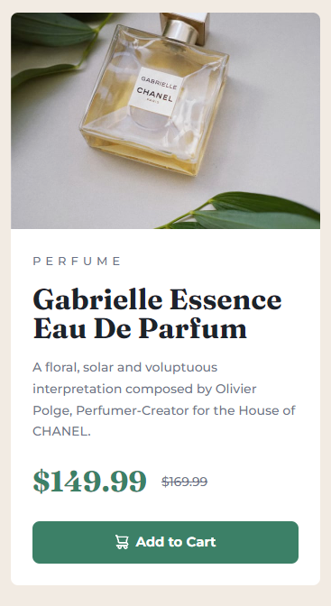

# Frontend Mentor - Product preview card component solution

This is a solution to the [Product preview card component challenge on Frontend Mentor](https://www.frontendmentor.io/challenges/product-preview-card-component-GO7UmttRfa). Frontend Mentor challenges help you improve your coding skills by building realistic projects.

## Table of contents

- [Overview](#overview)
  - [The challenge](#the-challenge)
  - [Screenshot](#screenshot)
  - [Links](#links)
- [My process](#my-process)
  - [Built with](#built-with)
  - [What I learned](#what-i-learned)
    - [Media query on images using source tag](#media-query-on-images-using-source-tag)
    - [Visually hidden, but still read by screen readers](#visuali-hidden-but-still-read-by-screen-readers)
  - [Useful resources](#useful-resources)

## Overview

### The challenge

Users should be able to:

- View the optimal layout depending on their device's screen size
- See hover and focus states for interactive elements

### Screenshot




### Links

- Live Site URL: [LIVE SITE](https://warm-truffle-66850a.netlify.app/)

## My process

### Built with

- Semantic HTML5 markup
- CSS custom properties
- Flexbox
- CSS Grid

### What I learned

#### Media query on images using source tag

```html
<picture class="product__image">
  <source
    srcset="./images/image-product-desktop.jpg"
    media="(min-width: 600px)"
  />
  
</picture>
```

#### Visually hidden, but still read by screen readers

```html
<div class="flex-group">
  <p class="product__price">
    <span class="visually-hidden">Current Price:</span>
    $149.99
  </p>
  <p class="product__original-price">
    <span class="visually-hidden">Original Price:</span>
    <s>$169.99</s>
  </p>
</div>
```

```css
.visually-hidden:not(:focus):not(:active) {
  clip: rect(0 0 0 0);
  clip-path: inset(50%);
  height: 1px;
  overflow: hidden;
  position: absolute;
  white-space: nowrap;
  width: 1px;
}
```

### Useful resources

- [CSS Reset](https://www.joshwcomeau.com/css/custom-css-reset/#the-css-reset-1) - This helped to apply one css reset.
- [Inclusively Hidden](https://www.scottohara.me/blog/2017/04/14/inclusively-hidden.html) - This is an amazing article which helped me finally understand how to allow screen readers to read the contents for user accessibility. I'd recommend it to anyone still learning this concept.
